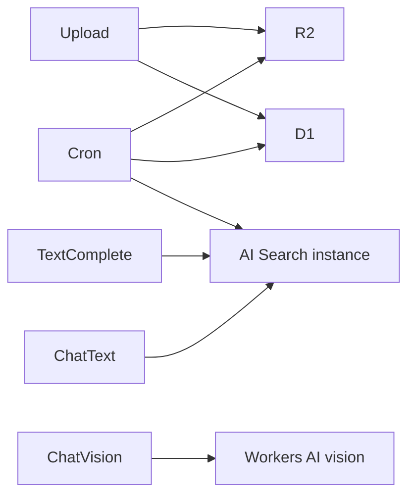

# Chat with Anything

Edge-native document Q&A demo on Cloudflare: **R2**, **AI Search**, **Workers AI**, **D1**, **KV**, **Cron**.

Upload a document → preview it → chat with it.

## Stack

- **Frontend:** React + Vite + Tailwind (served via Worker assets binding)
- **Backend:** Hono on Cloudflare Workers
- **Storage / AI:** R2, D1, AI Search, Workers AI, KV

See [`docs/PRD.md`](docs/PRD.md) for the full product spec and [`docs/ai-search-spike.md`](docs/ai-search-spike.md) for AI Search findings.

## Architecture

Two pipelines, one chat UI:

| Upload type | Pipeline | Chat backend |
|-------------|----------|--------------|
| PDF, TXT, MD | `text` | Per-doc AI Search instance → `chatCompletions()` |
| PNG, JPG, WEBP | `vision` | Workers AI `@cf/meta/llama-3.2-11b-vision-instruct` |



Text files are capped at **4MB** for AI Search Items API indexing (R2 preview allows up to 20MB for images).

## Prerequisites

- Node.js 22+ (see `.nvmrc`)
- [pnpm](https://pnpm.io/)
- Cloudflare account (`npx wrangler login`)

## Setup

```bash
pnpm install
pnpm d1:migrate:local
pnpm build
```

Run `pnpm d1:migrate:local` once before first local dev session. Do not add comments on the same line — zsh/pnpm can pass `# ...` text through as extra arguments.

For deploy and AI Search, provision remote resources after `wrangler login`:

```bash
pnpm exec wrangler d1 create chat-with-anything
pnpm exec wrangler kv namespace create RATE_LIMIT
pnpm exec wrangler r2 bucket create chat-with-anything-files
```

Then update `database_id` and KV `id` in `wrangler.jsonc` and run `pnpm exec wrangler types`.

## Development

**Requires Node.js 22+** (see `.nvmrc`). Run `nvm use` if you use nvm.

Run the UI and Worker in two terminals:

```bash
nvm use
pnpm build

# Terminal 1 — React dev server (proxies /api → Worker)
pnpm dev

# Terminal 2 — Cloudflare Worker (local bindings only; no login required)
pnpm dev:worker
```

- UI: http://localhost:5173
- Worker: http://localhost:8787
- Health check: http://localhost:8787/api/v1/health

`pnpm dev:worker` uses `wrangler.local.jsonc` (R2, D1, KV, assets — all local). AI bindings are omitted so you can develop upload/preview without `wrangler login`. Text indexing and chat require deploy or remote AI bindings.

For full AI pipeline testing:

```bash
pnpm exec wrangler login
pnpm deploy
```

## API

| Method | Path | Description |
|--------|------|-------------|
| GET | `/api/v1/health` | Smoke test |
| POST | `/api/v1/documents/presign` | Start upload (rate limited) |
| PUT | `/api/v1/documents/:id/upload` | Upload bytes to R2 |
| POST | `/api/v1/documents/:id/complete` | Finalize + start indexing |
| GET | `/api/v1/documents/:id/status` | Poll indexing status |
| POST | `/api/v1/documents/:id/chat` | SSE chat stream |
| GET | `/api/v1/documents/:id/preview` | Document preview bytes |

## Scripts

| Command | Description |
|---------|-------------|
| `pnpm dev` | Vite dev server |
| `pnpm dev:worker` | Wrangler dev |
| `pnpm build` | Build UI to `dist/` |
| `pnpm d1:migrate:local` | Apply D1 migrations to local dev database |
| `pnpm typecheck` | TypeScript check |
| `pnpm deploy` | Build + deploy to Cloudflare |
| `pnpm seed:samples` | Upload demo samples to R2 and register them in production |

## Sample documents

The landing page links to two fixed demo ids: `sample_text_demo` and `sample_image_demo`.
Source files live in `samples/`. They are exempt from the 24h expiry cron.
The text sample uses direct Workers AI (full document in context) so it works without
AI Search indexing. Re-seed after changing sample files.

Seed them once in production after deploy:

```bash
# Set a secret on the Worker (one time; use printf to avoid a trailing newline)
printf '%s' 'your-secret-here' | pnpm exec wrangler secret put SEED_SECRET --config wrangler.jsonc

# Upload R2 files + register D1 rows + index the text sample
export SEED_SECRET=the-same-secret
pnpm seed:samples
```

The script uploads `samples/*` to R2, then calls `POST /api/v1/admin/seed-samples` on the
deployed Worker. Re-run safely after sample content changes.

## Portfolio notes

- **No custom RAG** — AI Search handles chunking, embedding, and retrieval for text docs.
- **Vision bypasses search** — images never touch AI Search; direct Workers AI vision call.
- **24h retention** — daily Cron deletes R2 + AI Search instance + D1 row (see `src/worker/jobs/expire-documents.ts`).
- **AI Search API maturity** — per-doc instances and Items API are recent; spike doc captures limits and fallbacks.

## Implementation

Tracked in [GitHub Issues](https://github.com/abudhakeer/chat-with-anything-demo/issues).

Issues **#5–#10** implemented in this repo: AI Search indexing, vision chat, streaming API, split-view UI, cron expiry, and KV rate limiting.

Live demo: https://chat-with-anything.abudhakeer.workers.dev
